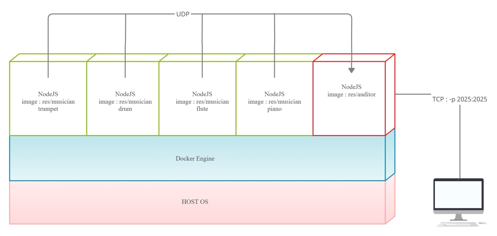

# Teaching-HEIGVD-RES-2020-Labo-Orchestra

## Admin

* **You can work in groups of 2 students**.
* It is up to you if you want to fork this repo, or if you prefer to work in a private repo. However, you have to **use exactly the same directory structure for the validation procedure to work**. 
* We expect that you will have more issues and questions than with other labs (because we have a left some questions open on purpose). Please ask your questions on Telegram / Teams, so that everyone in the class can benefit from the discussion.

## Objectives

This lab has 4 objectives:

* The first objective is to **design and implement a simple application protocol on top of UDP**. It will be very similar to the protocol presented during the lecture (where thermometers were publishing temperature events in a multicast group and where a station was listening for these events).

* The second objective is to get familiar with several tools from **the JavaScript ecosystem**. You will implement two simple **Node.js** applications. You will also have to search for and use a couple of **npm modules** (i.e. third-party libraries).

* The third objective is to continue practicing with **Docker**. You will have to create 2 Docker images (they will be very similar to the images presented in class). You will then have to run multiple containers based on these images.

* Last but not least, the fourth objective is to **work with a bit less upfront guidance**, as compared with previous labs. This time, we do not provide a complete webcast to get you started, because we want you to search for information (this is a very important skill that we will increasingly train). Don't worry, we have prepared a fairly detailed list of tasks that will put you on the right track. If you feel a bit overwhelmed at the beginning, make sure to read this document carefully and to find answers to the questions asked in the tables. You will see that the whole thing will become more and more approachable.


## Requirements

In this lab, you will **write 2 small NodeJS applications** and **package them in Docker images**:

* the first app, **Musician**, simulates someone who plays an instrument in an orchestra. When the app is started, it is assigned an instrument (piano, flute, etc.). As long as it is running, every second it will emit a sound (well... simulate the emission of a sound: we are talking about a communication protocol). Of course, the sound depends on the instrument.

* the second app, **Auditor**, simulates someone who listens to the orchestra. This application has two responsibilities. Firstly, it must listen to Musicians and keep track of **active** musicians. A musician is active if it has played a sound during the last 5 seconds. Secondly, it must make this information available to you. Concretely, this means that it should implement a very simple TCP-based protocol.


### Instruments and sounds

The following table gives you the mapping between instruments and sounds. Please **use exactly the same string values** in your code, so that validation procedures can work.

| Instrument | Sound         |
|------------|---------------|
| `piano`    | `ti-ta-ti`    |
| `trumpet`  | `pouet`       |
| `flute`    | `trulu`       |
| `violin`   | `gzi-gzi`     |
| `drum`     | `boum-boum`   |

### TCP-based protocol to be implemented by the Auditor application

* The auditor should include a TCP server and accept connection requests on port 2205.
* After accepting a connection request, the auditor must send a JSON payload containing the list of <u>active</u> musicians, with the following format (it can be a single line, without indentation):

```
[
  {
  	"uuid" : "aa7d8cb3-a15f-4f06-a0eb-b8feb6244a60",
  	"instrument" : "piano",
  	"activeSince" : "2016-04-27T05:20:50.731Z"
  },
  {
  	"uuid" : "06dbcbeb-c4c8-49ed-ac2a-cd8716cbf2d3",
  	"instrument" : "flute",
  	"activeSince" : "2016-04-27T05:39:03.211Z"
  }
]
```

### What you should be able to do at the end of the lab


You should be able to start an **Auditor** container with the following command:

```
$ docker run -d -p 2205:2205 res/auditor
```

You should be able to connect to your **Auditor** container over TCP and see that there is no active musician.

```
$ telnet IP_ADDRESS_THAT_DEPENDS_ON_YOUR_SETUP 2205
[]
```

You should then be able to start a first **Musician** container with the following command:

```
$ docker run -d res/musician piano
```

After this, you should be able to verify two points. Firstly, if you connect to the TCP interface of your **Auditor** container, you should see that there is now one active musician (you should receive a JSON array with a single element). Secondly, you should be able to use `tcpdump` to monitor the UDP datagrams generated by the **Musician** container.

You should then be able to kill the **Musician** container, wait 5 seconds and connect to the TCP interface of the **Auditor** container. You should see that there is now no active musician (empty array).

You should then be able to start several **Musician** containers with the following commands:

```
docker run -d res/musician piano
docker run -d res/musician flute
docker run -d res/musician flute
docker run -d res/musician drum
```
When you connect to the TCP interface of the **Auditor**, you should receive an array of musicians that corresponds to your commands. You should also use `tcpdump` to monitor the UDP trafic in your system.


## Task 1: design the application architecture and protocols

| #  | Topic |
| --- | --- |
|Question | How can we represent the system in an **architecture diagram**, which gives information both about the Docker containers, the communication protocols and the commands? |
| | <br />Correction : le port TCP utilisé est `2205`. |
|Question | Who is going to **send UDP datagrams** and **when**? |
| | Les conteneurs de l'image `res/musiciens`, avec un intervalle de une seconde. |
|Question | Who is going to **listen for UDP datagrams** and what should happen when a datagram is received? |
| | Le conteneur de l'image res/orchestra. Il va enregistrer en local tous les musiciens actif qui envoient au moins un payload toute les 5 secondes. |
|Question | What **payload** should we put in the UDP datagrams? |
| | un `id` unique, qui va permettre d'identifier le musicien pour chacune de ces requêtes, et aussi le "son" qu'il emet avec son instrument. |
|Question | What **data structures** do we need in the UDP sender and receiver? When will we update these data structures? When will we query these data structures? |
| | **Sender :** Il faut un dictionnaire qui soit capable de produire un son en fontion de l'instument défini. Il faut aussi une string, qui va contenir le payload à envoyer, et enfin le payload au format json. Il faut aussi une buffer qui va contenir la structure à envoyer. Les trois structures n'ont besoin d'être généré qu'une seule fois car elle ne bougeront pas de toute l'execution du programme. Le payload envoyé sera toujours le même. |
| | **Receiver** : Il faut un dictionnaire qui soit capable de deviner l'instrument du musicien en fonction de son bruit, un structure temporaire qui reçoit le payload de l'envoyeur, et aussi une Map<uuid, array[instrument, activeSince, lastActivity]> qui va garder sur toute son exécution les `Sender` actifs. Le payload reçu de l'utilisateur est créé pour chaque arrivée de paquet (même ceux pas valide). Le dictionnaire va rester statique sur toute l'exécution la durée de vie du `Receiver`.  Dernièrement, la structure dictionnaire qui contient les musiciens actif va être mise à jour dans trois cas : un nouveau musicien vient d'arriver, on crée un enregistrement. Deuxième cas : Un musiciens existant vient de renvoyer un payload valide, on remet donc à jour le moment de sa dernière activité. Troisème cas : Le musiciens n'a pas envoyé de message depuis 5 seconde, alors celui-ci est supprimé du dictionnaire des musiciens actif. |


## Task 2: implement a "musician" Node.js application

| #  | Topic |
| ---  | --- |
|Question | In a JavaScript program, if we have an object, how can we **serialize it in JSON**? |
| | `JSON.stringify( valeur[, remplaçant [, espace]])` |
|Question | What is **npm**?  |
| | Le paquet manager normalisé pour le développement d'application avec NodeJs. |
|Question | What is the `npm install` command and what is the purpose of the `--save` flag?  |
| | `npm install` va permettre de télécharger en local un package pour l'utiliser dans une application. Initialement, le flag `--save` permettait de mettre les librairies installées dans les dépendance de `package.json`, seulement cette option n'est plus necessaire depuis la version `5.0.0` de `npm`. |
|Question | How can we use the `https://www.npmjs.com/` web site?  |
| | On peut l'utiliser pour se documenter les packages disponible, et aussi publier nos propre packages avec les versions payante. |
|Question | In JavaScript, how can we **generate a UUID** compliant with RFC4122? |
| | Avec la librairie `uuid`, que l'on peut exploiter dans nos projets avec`const { v4: uuidv4 } = require('uuid');` et importer en local avec `npm` |
|Question | In Node.js, how can we execute a function on a **periodic** basis? |
| | Il faut utiliser la fonction de JavaScript `setInterval(*function, milliseconds, param1, param2, ...*)` |
|Question | In Node.js, how can we **emit UDP datagrams**? |
| | `var dgram = require('dgram');` //on utilise dgram, recommandé pour traffic UDP<br /> `var socket = dgram.createSocket('udp4');` //create UDP socket<br />`message = Buffer.from(payload);` // we create a buffer from our content<br />`socket.send(message, 0, message.length, PORT_DEST, IP_DEST, function(err, bytes) {});`<br /> |
|Question | In Node.js, how can we **access the command line arguments**? |
| | `process.argv[n];` <br />Comme en C, il faut commencer par n = 2. |


## Task 3: package the "musician" app in a Docker image

| #  | Topic |
| ---  | --- |
|Question | How do we **define and build our own Docker image**?|
| | Si l'on souhaite créer une image personnelle, il faut tout installer ce que l'on a besoin en configurant un `Dockerfile`, et ensuite la build avec `docker build .` dans le dossier courrant. Il est cependant recommendé d'utiliser une image déjà existante car elles sont mise à jour régulièrement. |
|Question | How can we use the `ENTRYPOINT` statement in our Dockerfile?  |
| | `ENTRYPOINT` a deux formes possible : <br />`ENTRYPOINT ["executable", "param1", "param2"]` ou <br />`ENTRYPOINT command param1 param2` //shell form<br />Après, il sera possible de créer un containeur avec un paramètre. (instrument dans ce laboratoire) |
|Question | After building our Docker image, how do we use it to **run containers**?  |
| | Il suffit de lancer la commande de run en rajoutant un seul argument qui doit être un des instruments disponible dans l'application soit avec ` docker run -d res/musician { piano | trumpet | flute | violin | drum  }` |
|Question | How do we get the list of all **running containers**?  |
| | `docker ps` |
|Question | How do we **stop/kill** one running container?  |
| | `docker stop { CONTAINER ID  | CONTAINER NAME }`. Si cette commande ne fonctionne pas, il est possible de forcer extinction avec`docker kill { CONTAINER ID  | CONTAINER NAME }`. |
|Question | How can we check that our running containers are effectively sending UDP datagrams?  |
| | Avec tcpdump, il est possible de surveiller le traffic UDP avec `tcpdump -i eth0 -s 0 -v udp`. |


## Task 4: implement an "auditor" Node.js application

| #  | Topic |
| ---  | ---  |
|Question | With Node.js, how can we listen for UDP datagrams in a multicast group? |
| | Il suffit d'écouter sur le port choisi pour communiquer, et après rajouter qu'on écoute seulement sur l'adresse de multicast (239.255.22.5) avec la fonction `addMembership` qui va anoncer au kernel que le serveur rejoint un groupe multicast. (https://nodejs.org/api/dgram.html#dgram_socket_addmembership_multicastaddress_multicastinterface) |
|Question | How can we use the `Map` built-in object introduced in ECMAScript 6 to implement a **dictionary**?  |
| | On peut l'utiliser une clé unique `key` pour identifier n'importe quel objet JavaScript. On peut savoir si un mot existe avec la fonction `has(object)`, mettre à jour ou insérer avec `put(key, object`), et récupérer un éléments avec `get(key)`. |
|Question | How can we use the `Moment.js` npm module to help us with **date manipulations** and formatting?  |
| | On peut utiliser la fonction `moment()` pour identifier la date et heure courrante des moments d'arrivée et les derniers messages des différents musiciens actifs. De plus, `Moment.js` possède plusieurs méthodes pour modifier(`add()`, `substract()`, ...) et formater des dates très facilement (`format()`). La documentation est très complète : https://momentjs.com/docs/ |
|Question | When and how do we **get rid of inactive players**?  |
| | Il faut avoir un timer qui permet tout les` x` temps d'itérer tous les `musiciens` qui n'ont pas envoyé de message depuis 5 dernière secondes. Le temps x choisi doit être assez court pour être réactif, et pas trop long afin de ne pas trop ralentir le système. Nous avons choisi de parcourir cette liste toute les 0.5 secondes. |
|Question | How do I implement a **simple TCP server** in Node.js?  |
| | Il faut attendre les connexions TCP sur le port désiré, et dès qu'un client arrive, un socket est créé, et il est possible de `read` et `write` sur un `buffer`. Dans notre cas, le serveur détruit le socket dès que le client a bien reçu le payload. Cette manoeuvre est nécessaire car sinon la connexion ne se termine pas. |


## Task 5: package the "auditor" app in a Docker image

| #  | Topic |
| ---  | --- |
|Question | How do we validate that the whole system works, once we have built our Docker image? |
|  | On peut utiliser le script fourni qui va tester que le système complet fonctionne dans un contexte normal. Cependant, il ne teste les cas particulier comme des payload reçu qui sont invalides, ou un mauvais paramètre d'entrée au musicien. <br />Pour le musicien, il a suffit de créer une image avec `docker run res/musician guitare` et `docker run res/musician` et dans les deux cas cela n'a pas fonctionné, comme souhaité avec le containeur qui s'éteint directement.<br />Par contre, il est plus difficile de vérifier qu'un payload invalide soit écarté correctement. Pour cela, nous avons créer un payload invalide depuis un containeur, et nous avons observé que ce paquet n'est pas pris en compte. On peut visualiser dans les log sur `Receiver` qu'il a bien écarter un paquets. <br />Il n'existe aucune autre entrée utilisateur possible, donc on peut en conclure que l'on peut correctement valider notre application. |


## Constraints

Please be careful to adhere to the specifications in this document, and in particular

* the Docker image names
* the names of instruments and their sounds
* the TCP PORT number

Also, we have prepared two directories, where you should place your two `Dockerfile` with their dependent files.

Have a look at the `validate.sh` script located in the top-level directory. This script automates part of the validation process for your implementation (it will gradually be expanded with additional operations and assertions). As soon as you start creating your Docker images (i.e. creating your Dockerfiles), you should try to run it.